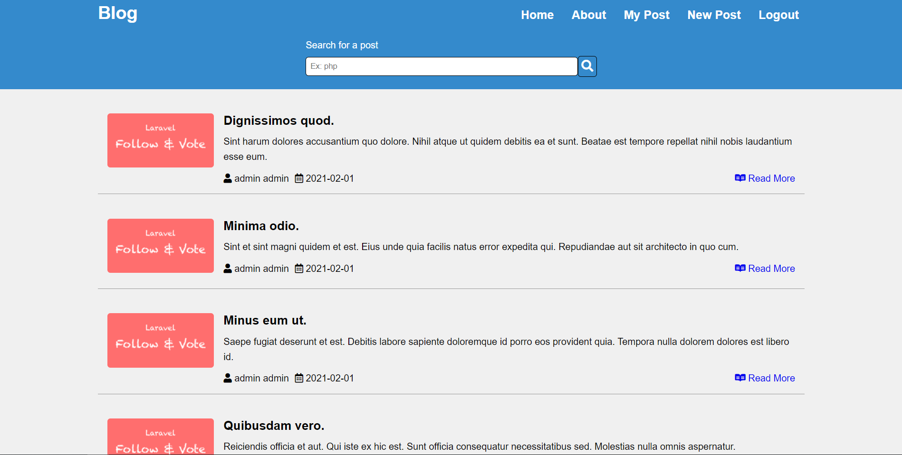

# PHP Blog MVC



## Description
---

This project is blog, built in MVC design pattern, where user can read any post and even create an account to create their own posts!

## Main Features
---

- Login and register System
- read any posts
- Create posts
- Update posts
- Delete posts

## Requirements
---
- php: ^7.4 | ^8.0
- composer
- ext-pdo: *

## Installation and Setup
---

### Project Set up

First you need to clone this repo or download the zip and extract!

Then, inside the project, run the following command in your terminal to install the dependencies.

```
composer install
```

And, last but not the least, remove the .example from the .env.example then change the variables' value to your database and domain info!

### DataBase Set up

To set up the database you just need to run the following commands in your MySQL workbench!

```
create database db_name;

use db_name;

create table users(
	id int primary key auto_increment,
    name varchar(50) not null,
    lastName varchar(50) not null,
    password varchar(255) not null,
    email varchar(255) not null unique,
    created_at timestamp not null default now(),
    updated_at timestamp default null
);

create table profiles(
	id int primary key auto_increment,
    nickname varchar(50) unique not null,
    hasPhoto boolean not null default false,
    photoPath varchar(255),
    user_id int not null,
    foreign key(user_id) references users(id) on delete cascade,
	created_at timestamp not null default now(),
    updated_at timestamp default null
);

create table posts(
	id int primary key auto_increment,
    title varchar(50) not null,
    description varchar(255) not null,
    paragraph varchar(255) not null,
    hasPhoto boolean not null default false,
    photoPath varchar(255),
    user_id int,
    foreign key(user_id) references users(id) on delete set null,
    created_at timestamp not null default now(),
    updated_at timestamp default null
);

insert into users(name, lastName, password, email) -- password = 1234
value("admin", "admin", "$2y$10$.Z6C6DbZ/m.9PCGv3v486.AoqsgLITH/0XLg/38LLVzJV1HdcONRq", "admin@admin.com");

insert into profiles(nickname, user_id)
value("admin", 1);
```

